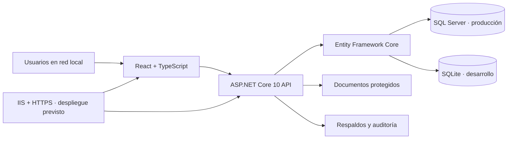

# Clínica Serena

Sistema clínico web para administrar pacientes, citas, expedientes, documentos, pagos, empresas y accesos por rol. Su interfaz sigue la dirección visual **Salud serena**: clara, sobria y pensada para separar el trabajo operativo, clínico y administrativo.

> Estado actual: MVP funcional para demostración y pruebas locales. La aplicación está preparada para desplegarse con ASP.NET Core, IIS y SQL Server, pero ese despliegue todavía debe validarse antes de usar datos clínicos reales.

## Qué resuelve

- Registra y administra pacientes, profesionales, servicios, consultorios y empresas.
- Agenda citas con reglas de disponibilidad, duración, conflictos, confirmación, llegada y cierre de atención.
- Mantiene expedientes clínicos, notas de consulta y documentos con acceso restringido.
- Gestiona pagos, comprobantes internos, convenios y reportes operativos.
- Da a cada persona una experiencia acorde a su función: recepción, médico, paciente, empresa, finanzas, auditoría, soporte o administración.
- Protege las sesiones con permisos comprobados por la API, TOTP, reautenticación para acciones sensibles y auditoría.

## Arquitectura



La interfaz y la API se publican bajo un mismo origen. Los documentos se almacenan fuera de `wwwroot`, la autorización se vuelve a comprobar en el servidor y los datos se limitan al alcance de la cuenta que hizo la solicitud.

## Espacios de trabajo

| Perfil | Herramientas principales | Límites relevantes |
|---|---|---|
| Paciente | Perfil, citas propias, documentos publicados y servicios | Solo su información; sin listas internas ni expediente completo |
| Médico | Agenda, pacientes asignados, expedientes y documentos | Sin funciones de recepción, cobros o administración de usuarios |
| Recepción | Pacientes, agenda, citas, confirmación y check-in | Sin diagnósticos, tratamientos ni notas clínicas |
| Empresa | Empleados asociados, cobertura, consumos y reportes | Sin expediente, CURP, motivos de consulta ni información clínica |
| Administración clínica | Médicos, espacios, pacientes, agenda y reportes | Sin acceso automático a notas médicas |
| Administración financiera | Servicios, pagos, comprobantes, convenios y reportes | Acceso mínimo a identidad; sin información clínica |
| Administración de usuarios | Cuentas, roles, permisos, sesiones y auditoría | Solo puede delegar permisos que también posee |
| Auditor | Eventos y reportes agregados | Lectura controlada, sin expedientes ni motivos clínicos |
| Soporte | Diagnóstico de la aplicación y estado de respaldos | No administra IIS, RDP ni SQL Server desde la web |
| Superadministrador | Configuración integral de la aplicación | No sustituye la administración de Windows Server |

Las rutas visibles, los formularios y los datos devueltos por la API dependen de permisos efectivos y del tipo de acceso. Ocultar un botón no es el control de seguridad: la API vuelve a validar cada acción y cada registro.

## Funcionalidades disponibles

### Atención clínica y operación

- Dashboard con métricas y pendientes según el área de trabajo.
- Pacientes con CURP única, contacto, empresa asociada, estado y folio.
- Médicos, personal, especialidades, horarios, espacios y servicios.
- Agenda diaria, semanal y mensual; filtros por médico, consultorio y estado.
- Citas con validación de traslapes por paciente, médico y consultorio.
- Confirmación, cancelación, rechazo, reprogramación, check-in e historial de cambios.
- Expedientes con antecedentes, alergias, notas, diagnóstico, tratamiento y cierre de nota por autor.
- Documentos PDF, PNG y JPEG de hasta 10 MB, descarga autorizada y publicación selectiva para el paciente.

### Administración

- Usuarios, activación o baja, roles, permisos, vigencia, equipos compartidos y cierre de sesiones.
- Pagos, liquidación, anulación con motivo y comprobantes imprimibles.
- Empresas, convenios, vigencia y cobertura explícita de citas, pagos y documentos.
- Reportes por periodo, estado, médico, servicio, cancelaciones e ingresos; exportación CSV controlada.
- Auditoría de accesos, consultas, cambios, descargas, denegaciones y eventos de seguridad.
- Respaldos manuales de base de datos y documentos con manifiesto de hashes.
- Diagnóstico de aplicación, conectividad y almacenamiento disponible.

### Seguridad y experiencia

- Inicio de sesión individual; no se diseñó para cuentas compartidas.
- Segundo factor TOTP para el personal, con códigos de recuperación y recuperación supervisada.
- Caducidad e inactividad de sesión, revocación desde administración y reautenticación para acciones críticas.
- Protección CSRF, cookies HttpOnly, límites de intentos, control de concurrencia y registros de auditoría sellados.
- Borradores cifrados del lado del servidor para formularios seleccionados.
- Navegación accesible, diseño adaptable, avisos visuales y sonidos locales opcionales.

## Alcance que permanece pendiente

Estas capacidades se contemplan para una fase posterior y **no forman parte de esta entrega**:

- Invitaciones de pacientes por correo, SMTP/Brevo, autorregistro y recuperación de cuenta por correo.
- Facturación CFDI/SAT, no solo comprobantes internos.
- Tarifas, autorizaciones y reglas automáticas por convenio.
- Inventario/farmacia, laboratorio, imagenología, telemedicina e integraciones externas.
- Restauración desde la web y administración de servicios de Windows desde cuentas clínicas.

## ClinicaDeploy: asistente visual de Windows

Ya existe un instalador técnico con la línea Salud Serena, separado de la aplicación clínica: instalación inicial sin demo, comprobación de requisitos, configuración de IIS/SQL local/HTTPS/ACL, actualización y reparación, tarea de respaldos cifrados, exportación de clave, recuperación en una base/carpeta nuevas e informes. No cambia RDP ni instala/licencia SQL Server automáticamente; correo y autorregistro siguen aplazados.

```powershell
npm run test:deploy
npm run build:deploy
```

El paquete se genera localmente en `artifacts/deploy/` y esa carpeta está excluida de Git. Para usarlo, ejecuta `npm run build:deploy` y entrega la carpeta generada con `ClinicaDeploy.exe`, `Deploy.ps1` y la publicación ZIP. La guía [DEPLOY.md](docs/DEPLOY.md) explica los datos solicitados, custodia de claves, permisos, modos de operación y aceptación. El ejecutable es autocontenido, pero la clínica requiere Hosting Bundle .NET 10 y SQL local preparados. La firma de código y validación completa en Windows Server/IIS/SQL son pendientes antes de producción.

## Ejecutar en desarrollo

### Requisitos

- Windows 10/11 o Windows Server con PowerShell.
- Node.js 22.12 o superior.
- SDK de .NET 10.

SQLite se utiliza únicamente durante el desarrollo. No se requiere SQL Server para explorar la demostración local.

```powershell
# Desde la raíz del proyecto
npm run dev
```

O, para iniciar y abrir el navegador:

```powershell
powershell -NoProfile -File scripts/Start-Development.ps1 -OpenBrowser
```

Abre [http://127.0.0.1:5175](http://127.0.0.1:5175). La API local utiliza el puerto `5080`.

### Cuentas de demostración

Las siguientes cuentas se crean solo en `Development` con `Demo:Enabled=true`; contienen datos ficticios.

| Usuario | Espacio |
|---|---|
| `admin` | Superadministración |
| `general` | Administración general |
| `accesos` | Gestión de usuarios |
| `coordinacion` | Administración clínica |
| `recepcion` | Recepción |
| `medico` | Espacio médico |
| `paciente` | Portal de paciente |
| `empresa` | Portal empresarial |
| `finanzas` | Administración financiera |
| `auditor` | Auditoría |
| `soporte` | Soporte técnico |

Contraseña de demostración: `SerenaDemo!2026`.

En el primer acceso de una cuenta no paciente, configura TOTP con Google Authenticator, Microsoft Authenticator, 2FAS u otra app compatible. Guarda los códigos de recuperación: solo se muestran una vez.

## Compilar y verificar

```powershell
# Compila frontend y publica API + interfaz en artifacts/clinica
npm run build

# Pruebas aisladas
npm run test:integration
npm run test:security
npm run test:roles
npm run test:workbench
npm run test:workbench-filters
npm run test:access-context
npm run test:calendar
npm run test:published
npm run test:experience
```

La última revisión local comprobó compilación de API e interfaz, publicación bajo un mismo origen, flujos principales y los espacios de los roles. Consulta [docs/VERIFICATION.md](docs/VERIFICATION.md) para el detalle y las limitaciones de esas pruebas.

## Preparar producción

El destino previsto es Windows Server 2019 con IIS, ASP.NET Core, SQL Server y almacenamiento protegido de documentos. Antes de tratar información clínica real se debe:

1. Ejecutar migraciones y pruebas reales contra SQL Server.
2. Publicar bajo IIS con HTTPS y un certificado confiable.
3. Usar una identidad de servicio sin privilegios administrativos y ACL específicas para aplicación, documentos, claves, logs y respaldos.
4. Mantener SQL Server fuera de la red de clientes; restringir firewall y RDP a redes de administración autorizadas.
5. Configurar protección antimalware para documentos, retención, respaldos cifrados externos y pruebas de restauración periódicas.
6. Validar concurrencia, carga, aceptación de usuarios y políticas de privacidad con la clínica.

El rol Superadministrador controla la aplicación; no administra Windows, IIS, SQL Server, RDP ni antivirus. Esas tareas pertenecen al equipo técnico del servidor.

## Estructura del proyecto

```text
backend/                 API ASP.NET Core, reglas de negocio y persistencia
  Features/              Endpoints por dominio
  Security/              Sesiones, permisos, TOTP y auditoría
  Infrastructure/        DbContext, datos de demostración y migraciones
frontend/                React + TypeScript + Vite
  src/pages/             Vistas clínicas, administrativas y portales
docs/                    Operación, seguridad, recuperación y verificaciones
database/                Script SQL Server generado para ClinicaDB
scripts/                 Inicio y publicación local
deploy/                  Asistente WPF, núcleo de integridad y motor de despliegue
tests/                   Pruebas de integración, seguridad y experiencia
```

## Documentación complementaria

- [Espacios, permisos y alcance de datos](docs/ROLE_WORKSPACES.md)
- [Seguridad y operación](docs/SECURITY.md)
- [Procedimiento de recuperación](docs/RECOVERY.md)
- [Instalación, actualización y continuidad con ClinicaDeploy](docs/DEPLOY.md)
- [Verificación local](docs/VERIFICATION.md)
- [Indicadores y workbenches por área](docs/WORKBENCHES.md)
- [Refinamiento de experiencia](docs/UX_REFINEMENT.md)

## Datos y uso responsable

El repositorio público contiene código fuente, pruebas, documentación, configuraciones de ejemplo y datos ficticios controlados para desarrollo. No contiene el ejecutable autocontenido ni publicaciones generadas: `artifacts/`, `bin/`, `obj/`, `data/`, `output/`, respaldos y paquetes están ignorados por Git. Nunca subas expedientes, documentos reales, credenciales, claves de Data Protection, certificados, archivos `.pfx`, respaldos ni configuraciones locales.

La aplicación no está certificada para uso clínico o legal en producción. Las obligaciones de privacidad, conservación, consentimiento, factura fiscal y operación del servidor deben validarse según la clínica y la jurisdicción aplicable.
